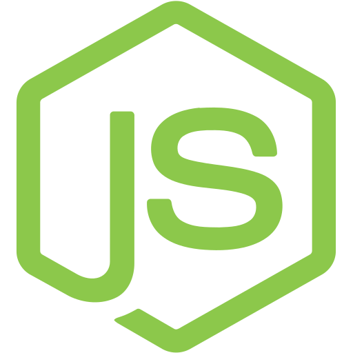
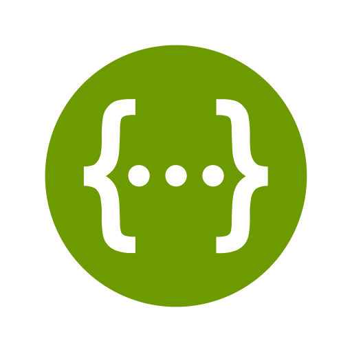
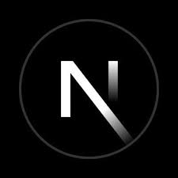
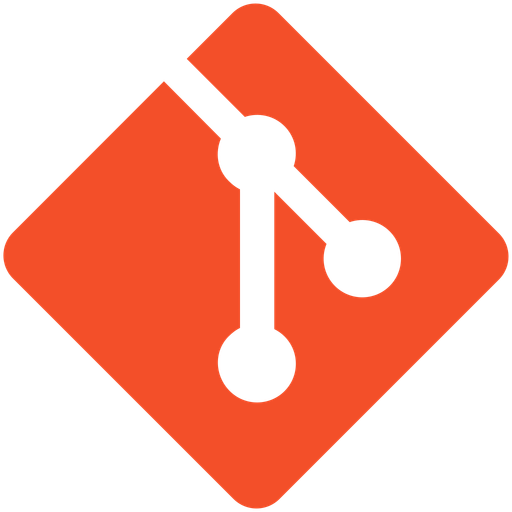

<table align="center" cellpadding="0" cellspacing="0" style="border-collapse: collapse;">
  <tr>
    <td align="center" style="border: none; padding-right: 28px;">
      <h1 style="font-size: 42px; margin-bottom: 8px;">
        Hi! I'm Sofía 👋
      </h1>
      

        Full Stack Developer 
        <strong>Backend Oriented</strong>
      

    </td>
    <td align="center" style="border: none;">
      
    </td>
  </tr>
</table>

### 🧩 About me

I’m a **Full Stack Developer oriented to Backend**, passionate about building solid APIs, business logic and scalable architectures.

My main focus is on **RESTful APIs**, authentication, role-based access, payments integration and database design.

I enjoy working on real-world problems, applying good practices and understanding _why_ things work, not just _how_.

### 🧩 Sobre mí

Soy Desarrolladora Full Stack con orientación en Backend, apasionada por la creación de APIs sólidas, lógica de negocio y arquitecturas escalables.

Mi foco principal está en el desarrollo de APIs REST, autenticación y autorización, manejo de roles, integración de pagos y diseño de bases de datos.

Disfruto trabajar en problemas reales, aplicar buenas prácticas de desarrollo y comprender el _por qué_ de las soluciones, no solo el _cómo_.

<h2 align="center">🛠️ Tech Stack</h2>

  
  
  
  
  
  
  
  
  
  
  
  
  
  
  

### 🚀 Featured Projects

⭐ **Providence Fitness API**  
Backend API for gym management: bookings, monthly payments per activity, roles, notifications and admin dashboard.  
Also contributed to frontend logic, developing the booking calendar and reservation flow.
**Stack:** NestJS · PostgreSQL · MercadoPago · JWT · Nodemailer · Cron jobs

⭐ **E-commerce REST API**  
Authentication, roles, products, orders and payments-ready structure.

 
 

### 💌 Let's connect

If you'd like to collaborate, talk about backend or check my work:

📧 **Email:** sofiadbartoli@gmail.com  
💼 **LinkedIn:** [linkedin.com/in/sofiabartoli](https://www.linkedin.com/in/sof%C3%ADa-desir%C3%A9e-bartoli-6aa23a15a)
